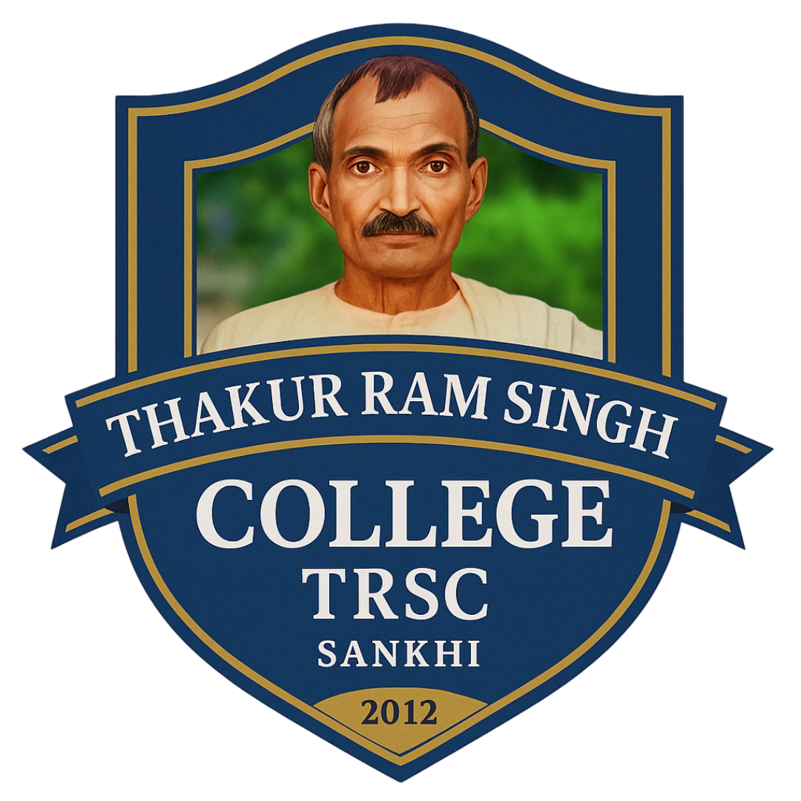

<p align="center">
  
</p>

<h1 align="center">Thakur Ram Singh College <br> (TRSC) - College Management System</h1>

<p align="center">
  <em>Empowering Education with Technology & Excellence</em>
</p>

<p align="center">
  
  
  
  
  
  
</p>

---

<p align="center" style="font-size:1.15em; color:#1a73e8; font-weight:bold;">
  <b>TRSC College Management System</b> is a next-generation, all-in-one platform for seamless college administration, staff, and student experience.<br/>
  <span style="color:#f7b731;">Modern. Secure. Branded. Ready for the future of education.</span>
</p>

---

## 🚀 Product Highlights

-  Logo, name, and theme everywhere—no generic or old references.
-  Glassmorphism, animations, and a luxury feel throughout.
-  Django authentication, password hashing, and robust data integrity.
-  Tailored for HOD/Admin, Staff, and Students.
- 
- 
-  Works beautifully on all devices.
- 

---

## 🛠️ Tech Stack

<table align="center">
  <tr>
    <th>Backend</th>
    <th>Frontend</th>
    <th>UI/UX</th>
    <th>Database</th>
    <th>Other</th>
  </tr>
  <tr>
    <td align="center">
      <br>
      
    </td>
    <td align="center">
      <br>
      <br>
      <br>
      <br>
      
    </td>
    <td align="center">
      <br>
      <br>
      <br>
      
    </td>
    <td align="center">
      
    </td>
    <td align="center">
      <br>
      
    </td>
  </tr>
</table>

---

## 📸 Screenshots & Demo

> _Add screenshots of the login page, dashboards, and contact messages inbox here for a more premium look._
> _You can also add a demo video or GIF for extra impact!_

---

## 🛡️ Security Features

- **Secure Authentication**: Django's built-in authentication system ensures that only authorized users can access the system.
- **Password Hashing**: Passwords are securely hashed using Django's password hashing algorithm.
- **Data Integrity**: The system ensures that data is not tampered with or corrupted.

---

## 🚀 Features at a Glance

- 🎨 <b>Modern Animated UI</b> (Glassmorphism, smooth transitions)
- 🏫 <b>TRSC Branding</b> (Logo, name, and colors everywhere)
- 👤 <b>Role-Based Dashboards</b> (HOD, Staff, Student)
- 📧 <b>Contact & Feedback System</b>
- 📊 <b>Attendance & Result Management</b>
- 📝 <b>Leave Management</b>
- 🔒 <b>Secure Authentication</b>
- 📱 <b>Responsive Design</b>

---

## ⚡ Quick Start

1. **Clone the Repository:**
   ```bash
   git clone https://github.com/NarenderSD/Thakur-Ram-Singh-College-Management-System.git
   cd college-management-system
   ```
2. **Create & Activate Virtual Environment:**
   - Windows:
     ```bash
     python -m venv env
     .\env\Scripts\activate
     ```
   - macOS/Linux:
     ```bash
     python3 -m venv env
     source env/bin/activate
     ```
3. **Install Dependencies:**
   ```bash
   pip install -r requirements.txt
   ```
4. **Run Migrations:**
   ```bash
   python manage.py makemigrations
   python manage.py migrate
   ```
5. **Start the Server:**
   ```bash
   python manage.py runserver
   ```

Visit: [http://127.0.0.1:8000/](http://127.0.0.1:8000/)

---

## 👨‍💻 Usage Guide

- **Registration:** Use your TRSC email (e.g., `yourname.hod@trsc.edu.in`, `yourname.staff@trsc.edu.in`, `yourname.student@trsc.edu.in`).
- **Login:** Use your registered email and password.
- **Dashboards:**
  - <b>HOD:</b> Manage staff, students, courses, subjects, view contact messages, etc.
  - <b>Staff:</b> Take attendance, manage results, feedback, leave, etc.
  - <b>Student:</b> View attendance, results, apply for leave, send feedback, etc.
- **Contact Form:** Public users can send queries via the contact page; HOD can view all messages in their dashboard.

---

## 🤝 Contributing

Contributions, issues, and feature requests are welcome!<br/>
Check the [issues page](https://github.com/NarenderSD/Thakur-Ram-Singh-College-Management-System/issues) or submit a pull request.

---

## ❓ FAQ

**Q: Is this system ready for real college deployment?**  
A: Yes! It is designed for real-world use, with security, branding, and modern UI/UX.

**Q: Can I customize it for my own college?**  
A: Absolutely! All branding and features are modular and easy to update.

**Q: How do I get support?**  
A: Use the contact form or reach out to the maintainer below.

---

## 📞 Contact & Support

- **Email:** [narendersingh2028@gmail.com](mailto:narendersingh2028@gmail.com)
- **Website:** [Comming Soon](https://www.linkedin.com/in/narendersingh1/)
- **Project Maintainer:** Narender Singh
- [](https://www.linkedin.com/in/narendersingh1/)

---

## 📜 Usage & Permission

> **Important:**
>
> - If you wish to use this project in your own work, for commercial purposes, or to earn/sell using this code, you **must** request permission from the author (Narender Singh) first.
> - Please connect with me on [](https://www.linkedin.com/in/narendersingh1/) and send a message for permission.
> - Any use, earning, or resale of this project without explicit permission is **not allowed**.
> - Respect the creator's rights and help maintain a fair, professional open-source community.

---

## 📄 License

This project is licensed under a custom license:
- **Personal and educational use is allowed.**
- **Commercial use, earning, or resale requires explicit written permission from the author.**
- For permission, contact [Narender Singh on LinkedIn](https://www.linkedin.com/in/narendersingh1/).

See the [LICENSE](LICENSE) file for full details.

---

<p align="center">
  <b>Built with ❤️ by Narender Singh <br> for Thakur Ram Singh College (TRSC)</b><br/>
  
</p>
